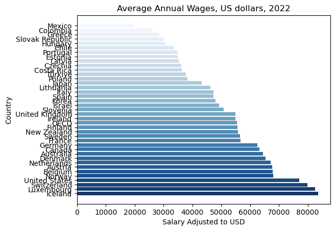

---

# Introduction

Thank you for taking the time to review my project! I am a data scientist based in Toronto, Canada, and I appreciate your interest in my work.

## Project Overview

This project visualizes the average annual salaries of OECD countries for the year 2022. All salary figures have been adjusted for Purchasing Power Parity (PPP) to account for differences in the cost of living across countries, providing a more accurate comparison of wages.

## Visualization

## About the OECD

The Organization for Economic Co-operation and Development (OECD) is an international organization that works to build better policies for better lives. It provides a forum where governments can collaborate to share experiences and find solutions to common challenges. The OECD collects and publishes a wide range of economic, social, and environmental data, aiding policymakers in making informed decisions.

You can find more details on the data used in this project at the following link: [OECD Average Annual Wages Data](https://www.oecd.org/en/data/indicators/average-annual-wages.html).

## Acknowledgments

I sincerely appreciate your time and feedback on this project. Your input is invaluable as I continue to develop my skills and contribute to the field of data science.

---

